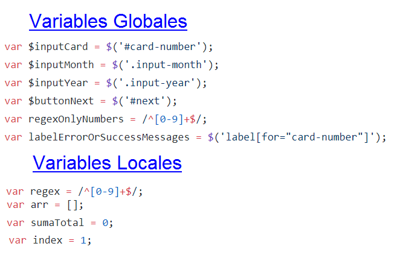

# Credit Card Form

## La Pila de Llamadas de Funciones (Call Stack)
###Objetivo :
Analizar el evento input por el cual se invoca el ingreso a una funcion , la salida de otras funciones  en la pila.

###Conceptos Básicos:

